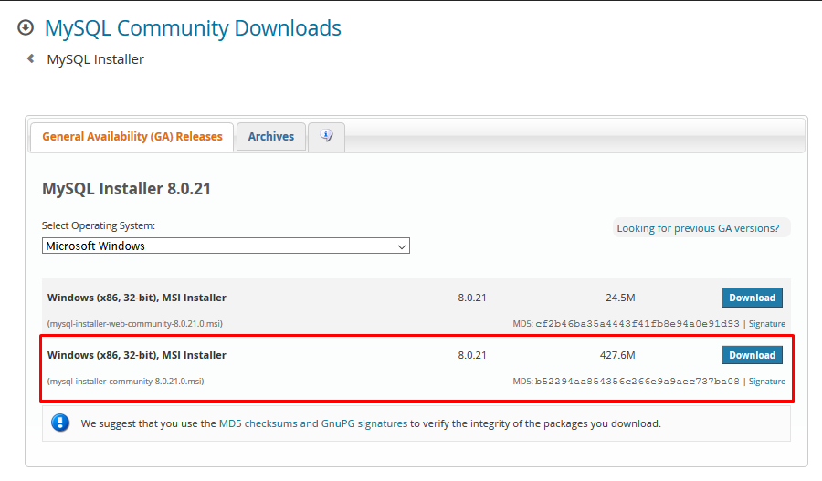
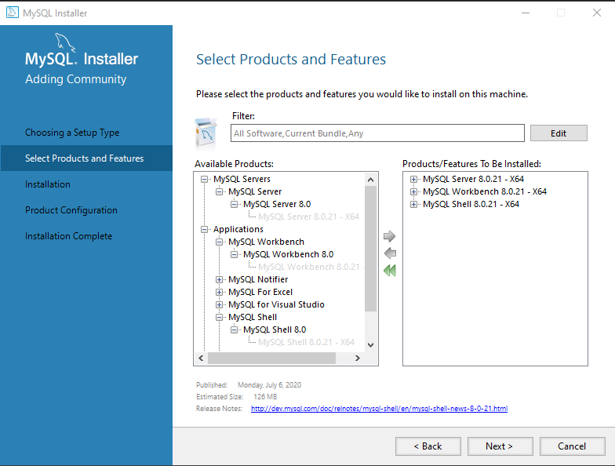
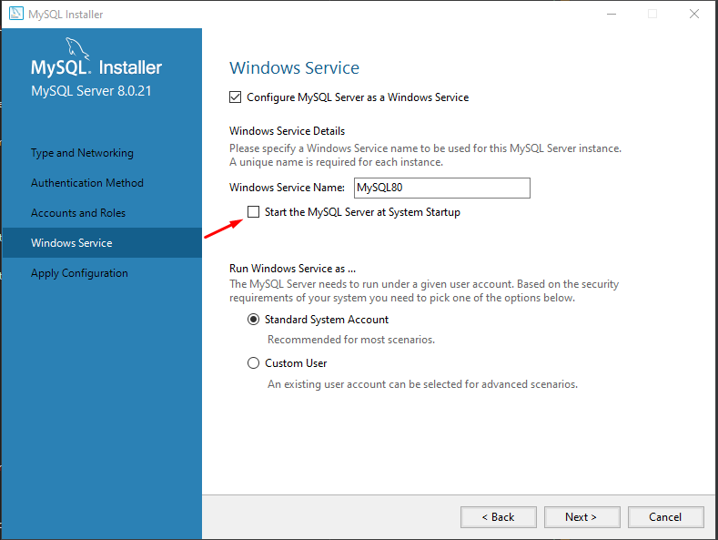
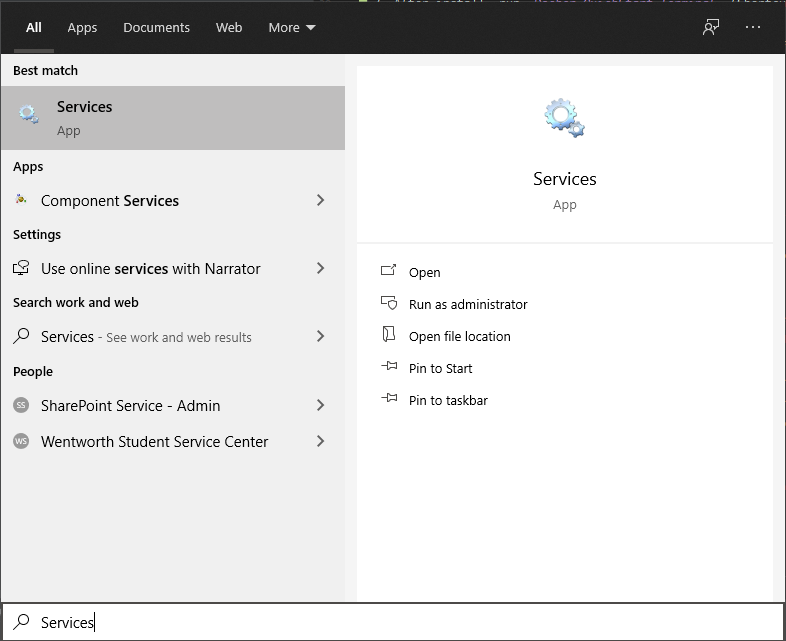
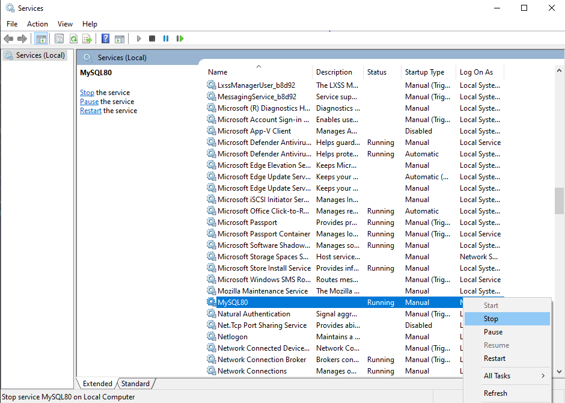

# comp4960-section1-black-team
Software Engineering Final Project (Group)

Group's work over the course of the project can be found under `/docs/`

#### Dev Environment Installation Instructions:
1. Download latest MySQL installer for Windows from `https://dev.mysql.com/downloads/installer/` (The second option with more downloads). 

    
    
2. Launch Installer and select `Custom` setup type.

3. Select `MySQL Server, MySQL Workbench, and MySQL Shell` as a minimum required for this project. Next > Execute and wait for installation to complete. 

    
    
4. MySQL Server will require extra configuration. Select default values (unless you know otherwise). Until you reach the following page:

    
    
    Here you will want to tell MySQL to not boot up on start. This is because we are running MySQL in docker on the same ports. If MySQL starts on windows, then there will be a port conflict when we start Docker. 
    
    Once you deselect the option, you can complete the install.
    
5. Task Bar > Services

    
    
6. Find MySQL Service and stop the service. This will shutdown the local MySQL instance which launches post install.

    

7. Go to https://docs.microsoft.com/en-us/windows/wsl/install-win10 and follow Steps 1-5 to enable WSL 2. Make sure `wsl --set-default-version 2` does not return `command unknown`. If it does, then reach out to repository admin. 

8. Download latest `Docker Desktop` https://www.docker.com/products/docker-desktop

9. Launch the installation and deselect `Hyper V Windows Features`. Make sure you select the `WSL 2` option. 

10. Install Docker. 

11. Run `docker run --name blackteam -e MYSQL_ROOT_PASSWORD=blackteam -p 3306:3306 -d mysql` to start a MySQL database within Docker. 
    
    `--name` will set the docker instance name to `blackteam`. 
    
    `MYSQL_ROOT_PASSWORD=blackteam` sets the root password to `blackteam`. The root password can be anything since we will create a custom user for the application to use later on. 
    
    `-p 3306:3306` will run MySQL on port `3306`.
    
    `-d` will detach the Docker instance from the terminal. I.e. no output will be posted in the terminal.
    
    If successful then we will a hash output of the instance. 
    
12. Open a command prompt and run the following command: `SET PATH=C:\Program Files\MySQL\MySQL Server 8.0\bin`. Make sure the path to MySQL program files is the same on your PC. For instance, your path may differ if you have multiple drives, or downloaded a different version than MySQL 8.0. 

    Adding this to your path will allow you to run MySQL commands in the command prompt by simply typing `mysql` for your current instance of command prompt. This will not persist.
    
13. Run `mysql -uroot -h localhost -p` and type in the root password for your MySQL instance running Docker.

14. Run 
    ```
    CREATE USER 'blackteam'@'%' IDENTIFIED BY 'blackteam';
    
    GRANT ALL PRIVILEGES ON * . * TO 'blackteam'@'%';
    
    FLUSH PRIVILEGES;  
    
    create database blackteam;
    ```
           
    To make a new user and database for the application. 
       
#### Intellij (Web App & Server Only)

1. Open IntelliJ and add a new project from Version Control, pasting in the HTTPS of the repository. 

2. In the bottom right of Intellij, click on `Event Log` and see the event mentioning the repository being a `Maven Project`. Click `Add Maven Project`

3. Wait until  dependencies have been updated, then click the green run button. Make the MySQL Docker instance is running.

#### VsCode (Web App & Server Only)

1. Open VsCode and install Java and Maven plugins

2. Preferences > Settings > Search For `Java Home`. Click `Edit In Settings.json`. Add your Java path, which should be like `C:\Program Files\Java\jdk-14.0.1` depending on your version.

3. Explorer > Maven > blackteam. Right click `blackteam` and click `Install`. Once that install is done, right click `blackteam` and click `custom`. Then paste in `frontend:install-node-and-yarn frontend:yarn process-resources spring-boot:build-image spring-boot:run`. This will run the application. Every time you want to run the application, right click `blackteam` and click `History`. Then select the string pasted in the `custom` dialog. 

#### Mobile App

The mobile app is a separate application then the main web app. To run the mobile app:

1. Run the server through the Maven configuration described above. Or by running the Spring Boot Framework individually. 

2. Navigate to `/src/mobile/` and run:

   ```bash
   npm install
   ```
   
3. Once dependencies are installed, run:

    ```bash
    npm start
    ```
   
   The mobile app will now launch in a web browser. The backend is the same server as the main web app. 
